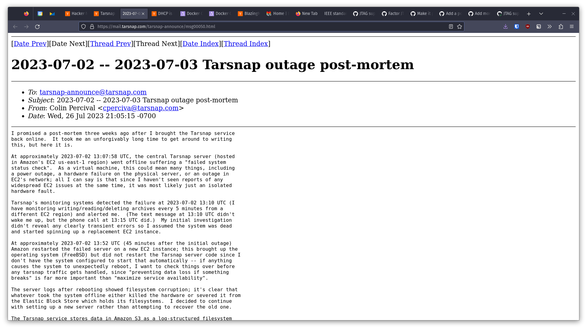
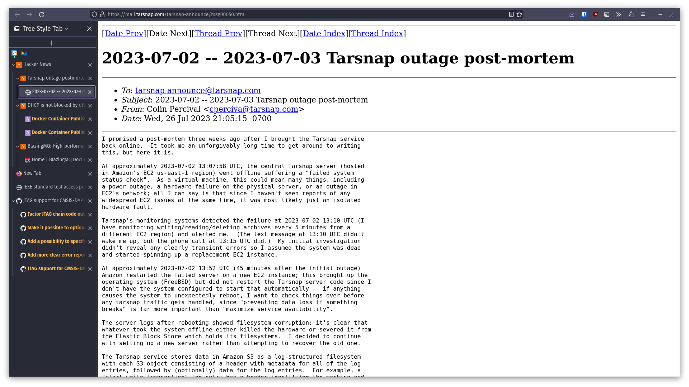

# The Best Firefox Setup

## Preview

### Before



### After



## Goals

I set out to satisfy a couple needs:

- A better way to manage 100+ tabs (chasing documentation rabbit holes leads to a lot of tabs)
- A visual indication of unread tabs (I often queue up things to read)
- An easy way to incrementally trace my steps back to what I was originally searching for

Here's how I went about it:

- Instead of the default tab bar, use [Tree Style Tab](https://addons.mozilla.org/en-US/firefox/addon/tree-style-tab/). This gives me several benefits:
  - The tree structure makes it much easier to navigate through my tabs, whether I'm looking for sibling tabs that add more info, or backtracking up the tree as after I've found answers to intermediate questions during my research.
- Tweaking [`userChrome.css`](https://www.userchrome.org/) to remove the default tab bar.
- Config tweaks to condense the nav bar.

## Setup

### Theme

My theme of choice is the [Dracula Dark](https://addons.mozilla.org/en-US/firefox/addon/dracula-dark-colorscheme/). In later sections, I use some this theme's CSS variables when overriding other widgets colors; if you use a different theme, you may need to tweak the CSS to suit your needs.

### Tree Style Tab

Install [Tree Style Tab](https://addons.mozilla.org/en-US/firefox/addon/tree-style-tab/).

Recommended settings:

- Appearance
    - Theme: Proton
- Tabs opened from Existing Tabs
    - Insertion position of new child tabs: The top of the tree (near the opener)`
- Tree Behavior
    - When a new tree appears, collapse other automatically: Disabled
    - When a tab gets focus, expand its tree and collapse others automatically: Disabled
    - Insertion position of new child tabs: The top of the tree (next to the parent)

I like child tabs to be inserted above their siblings (near the parent), as I my browsing behavior looks mostly like a bunch of stack operations -- I discover a new question, which results in pushing new context, and as I resolve my questions I want to pop back to where I started.

And some custom CSS to enter under "Advanced > Extra style rules for contents provided by Tree Style Tab":

```css
#tabbar {
    /* make scrollbar wider (otherwise too thin on high-DPI, IMO) */
    scrollbar-width: auto;
    /* more visible color for scrollbar on dark themes */
    scrollbar-color: var(--theme-colors-toolbar_field_text) var(--theme-colors-toolbar) !important;
}

/* Put "new tab" button at the top of the tab bar #1376  */
:root {
    --newtab-button-size: 30px;
}
.newtab-button-box {
    border-bottom: 1px solid var(--tab-border);
    position: fixed;
    top: 0;
    left: 0;
    right: 0;
    height: var(--newtab-button-size);
}
#tabbar {
    top: calc(var(--newtab-button-size) + 1px) !important;
    bottom: 0 !important;
}
tab-item.pinned {
    margin-top: calc(var(--newtab-button-size) + 1px) !important;
}

/* visually indicate active tab */
tab-item.active tab-item-substance {
    /* thin purple circle around active tab */
    border: solid 1px var(--theme-colors-toolbar_field_border_focus); 
    border-radius: 5px;
}

/* Visually indicate unread tabs */
:root.sidebar tab-item.unread .label-content {
    /* bold, gold color for unread */
    color: #FFBD4F !important;
    font-weight: bold;
}

/* Change styling of pending (unloaded) tabs */
tab-item.discarded tab-item-substance {
    /* make the text appear slightly grayed out */
    opacity: 0.65;
}
```

### TST New Tabs First 

I use [TST New Tabs First](https://addons.mozilla.org/en-US/firefox/addon/tst-new-tabs-first/) to ensure that new root tabs are positioned at the top, which further helps my stack-centric approach to browsing.

### UI density

I have good eyes, and also tend to work with larger screens anyway, so I'd rather not waste pixels on larger than necessary browser chrome. In `about:config`, I like to set `browser.uidensity` to `1` (`0` is generally the default, and `2` is *less* dense than that).

### userChrome.css

I use the following `userChrome.css` to remove the tab bar (and move the minimize and close buttons down into the nav bar):

```css
/* Hide the tab bar. */
#titlebar {
  visibility: collapse;
}

/* Position window controls */
#TabsToolbar .titlebar-buttonbox-container {
  display: block;
  position: absolute;
  visibility: visible;
  right: 0px;
}

/* Reposition the close/maximize/minimize buttons for the "normal" toolbar density  */
/* When the UI density is set to "normal", the `uidensity` attribute is undefined.  */
/* `window.document.documentElement.getAttribute("uidensity")` will be null.        */
:root:not([uidensity]) #TabsToolbar .titlebar-buttonbox-container {
  margin-right: 10px;
  margin-top: 7px;
}

/* Reposition the close/maximize/minimize buttons for the "compact" toolbar density */
:root[uidensity="compact"] #TabsToolbar .titlebar-buttonbox-container {
  margin-right: 5px;
  margin-top: 3px;
}

/*
 * Make room for window controls and a bit of extra space for window drag/move.
 */
#main-window #nav-bar {
  padding: 0px 80px 0px 0px !important;
}
```